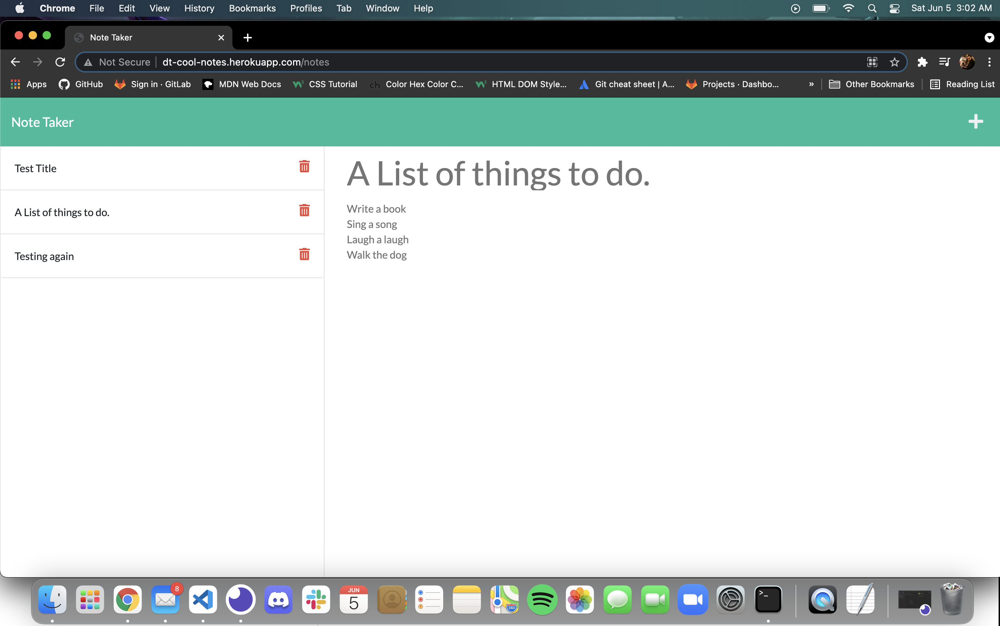

# Cool Notes

## General 

A Note Taker application showcasing the power of express using CRUD operations to save and retrieve note data from a JSON file. Nanoid is used create notes with unique IDs. 

## Table of Contents

- [Description](#description)
- [Setup](#setup)
- [Technologies](#technologies)
- [Links](#links)
- [Contact](#contact)
- [Preview](#preview)

### Setup
To run locally: 
* Start by cloning the repo by using the commands:
* `$ git clone git@github.com:d-trecker/cool-notes.git`
* From the root directory of the cloned repo, use the command `npm i` 
* Run `npm start` 

### Technologies
Created  with: 
* express: ^4.17.1
* nanoid: ^3.1.23
* Bootstrap

### Links
Repo Link: https://github.com/d-trecker/cool-notes  
Deployed Link: http://dt-cool-notes.herokuapp.com  

### Contact
Feel free to drop me a line @ [dylan.j.trecker@gmail.com](mailto:dylan.j.trecker@gmail.com?subject=[GitHub]%20Cool%20Notes)

### Preview

